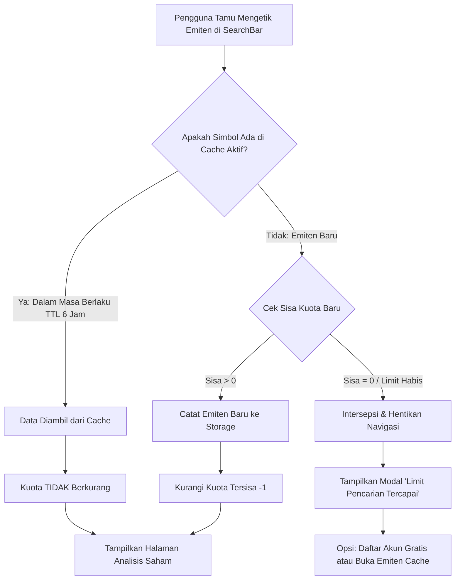

# Panduan Fitur Kuota Pencarian Tamu (Guest Search Quota) & Modal Limit

Dokumen ini menjelaskan rancangan, arsitektur teknis, aturan bisnis, dan panduan pengujian untuk fitur **Batas Kuota Pencarian Emiten Pengguna Tamu** pada platform **Sector Sense**.

---

## 🎯 1. Latar Belakang & Rasional Bisnis

Fitur **Akses Tamu (Guest Access)** memungkinkan investor atau calon pengguna langsung mencoba antarmuka analisis saham tanpa hambatan registrasi di awal (*zero-friction onboarding*).

Untuk menjaga efisiensi konsumsi kuota API pihak ketiga (Sectors API) sekaligus menciptakan pendorong alami bagi pengguna untuk mendaftarkan akun permanen (*freemium-to-sign-up conversion trigger*), platform memberlakukan batasan kuota pencarian:
- **Pengguna Tamu (Guest)**: Diberikan kuota pencarian bebas hingga **3 emiten baru** (default, dapat dikonfigurasi via environment variable).
- **Pengguna Terdaftar (Permanent User)**: Menikmati akses pencarian **tanpa batas (*unlimited*)**.
- **Pop-up Modal Limit Pencarian**: Muncul secara otomatis saat kuota habis dan pengguna mencoba mencari emiten baru ke-4, memberikan jalur langsung untuk mengonversi sesi tamu menjadi akun permanen secara instan tanpa kehilangan data simulasi.

---

## ⚙️ 2. Konfigurasi Variabel Lingkungan (Environment Variables)

Batas kuota dan durasi masa aktif cache emiten diatur secara fleksibel melalui variabel lingkungan yang dapat diubah kapan saja di `.env.local` atau pengaturan deployment produksi:

| Variabel Lingkungan | Tipe | Default | Keterangan |
|---|---|---|---|
| `NEXT_PUBLIC_GUEST_MAX_SEARCHES` | Integer | `3` | Jumlah maksimal emiten baru unik yang dapat dicari oleh pengguna tamu. |
| `NEXT_PUBLIC_GUEST_SEARCH_TTL_SECONDS` | Integer | `21600` | Durasi masa aktif cache emiten dalam detik (21.600 detik = 6 jam). Selaras dengan `TIER_TTLS.fundamental`. |

Contoh penulisan pada `.env.local`:
```env
NEXT_PUBLIC_GUEST_MAX_SEARCHES=3
NEXT_PUBLIC_GUEST_SEARCH_TTL_SECONDS=21600
```

---

## 🧠 3. Aturan Bisnis & Deduplikasi Berbasis TTL Cache

Sistem menerapkan aturan kalkulasi kuota cerdas agar tidak merugikan pengguna:



### Prinsip Kerja Utama:
1. **Deduplikasi Cache (Smart Caching)**:
   Jika pengguna tamu telah mencari `BBCA`, maka pencarian ulang terhadap `BBCA` dalam rentang 6 jam (TTL) **tidak akan memotong kuota baru**.
2. **Akses Emiten Cache Tetap Terbuka**:
   Bahkan ketika kuota telah 0/3 (limit tercapai), pengguna tamu tetap memiliki hak untuk membuka kembali 3 emiten yang sebelumnya sudah pernah mereka cari tanpa diblokir oleh modal limit.
3. **Pembersihan Otomatis (*Auto-Purge*)**:
   Jika rentang waktu TTL 6 jam telah terlewati, emiten lama akan dibersihkan dari daftar aktif sehingga kuota emiten tersebut kembali bebas untuk diisi analisis baru.

---

## 🏗️ 4. Arsitektur Komponen & Aliran Data

### 4.1. Modul Inti: `lib/auth/guest-quota.ts`
- Bertanggung jawab mengelola penyimpanan ganda:
  - **`localStorage` (`sector_guest_search_quota`)**: Menjamin reaktivitas instan dan persistensi di sisi peramban.
  - **Cookies (`sector_guest_search_count`)**: Menyediakan visibilitas jumlah pemakaian kuota untuk verifikasi SSR / Server Components / Middleware.
- Mengirimkan event kustom `sector_guest_quota_changed` dan memantau event `storage` agar perubahan kuota langsung tersinkronisasi di semua tab dan komponen peramban.

### 4.2. Hook Reaktif: `hooks/use-guest-quota.ts`
Menyediakan state reaktif untuk komponen UI Next.js:
- `count`: Jumlah emiten aktif saat ini.
- `limit`: Batas maksimal kuota (default: 3).
- `remaining`: Sisa kuota (`limit - count`).
- `hasReachedLimit`: Boolean apakah kuota sudah habis.
- `activeSearches`: Daftar emiten beserta cap waktu kadaluarsa.
- `recordSearch(symbol)`: Fungsi pencatatan pencarian.
- `isLimitModalOpen` & `setIsLimitModalOpen`: Kontrol visibilitas modal limit.

### 4.3. Komponen UI: `components/auth/search-limit-modal.tsx`
- Menggunakan arsitektur `@base-ui/react/dialog` yang sepenuhnya terikat dengan token warna semantik Tailwind (`bg-background`, `border-border`, `text-foreground`, `ring-ring`).
- Memaparkan nilai tambah registrasi permanen:
  - Analisis tanpa batas (*Unlimited search*)
  - Market Anomaly Scanner & Radar
  - Deteksi Dividend Trap & Financial Health Score
  - Penyimpanan portofolio permanen
- Menampilkan daftar emiten yang saat ini aktif di cache pengguna tamu.
- Tombol aksi:
  - **"Daftar Akun Gratis Sekarang"**: Mengarahkan ke `/register?upgrade=true`.
  - **"Sudah Punya Akun? Masuk"**: Mengarahkan ke `/login`.

### 4.4. Komponen Input: `components/dashboard/search-bar.tsx`
- Menampilkan badge dinamis:
  - Hijau: Kuota 2–3 tersisa.
  - Kuning: Kuota 1 tersisa.
  - Merah: Kuota 0 tersisa (Limit Tercapai).
- Menampilkan notifikasi visual `Tersimpan di cache (bebas kuota)` ketika pengguna mengetik simbol yang sudah pernah dicari.
- Memblokir pengiriman formulir dan langsung memicu modal limit jika pengguna mencoba mencari emiten baru ke-4.

### 4.5. Banner Global: `components/auth/guest-banner.tsx`
- Menyajikan ringkasan kuota tamu (`Sisa Kuota: X/3`) di bagian teratas layar agar pengguna selalu mengetahui status sesi mereka.

---

## 🔄 5. Alur Upgrade ke Akun Permanen

Ketika pengguna tamu menekan tombol **"Daftar Akun Gratis Sekarang"**:
1. Pengguna diarahkan ke form pendaftaran `/register?upgrade=true`.
2. Formulir mengeksekusi Server Action `upgradeGuestAccount()`.
3. Supabase mengonversi akun anonim menjadi akun email/password permanen **tanpa mengubah UUID pengguna**, sehingga seluruh data historis tetap utuh.
4. Cookie kuota tamu dibersihkan (`cookieStore.delete('sector_guest_search_count')`).
5. Status `isGuest` berubah menjadi `false`, dan pengguna secara otomatis mendapatkan akses pencarian **tanpa batas (*unlimited*)**.

---

## 🧪 6. Panduan Pengujian (Verification & Testing)

### 6.1. Menjalankan Pengujian Unit Otomatis
Jalankan pengujian unit spesifik kuota tamu:
```bash
node --test tests/guest-quota.test.mjs
```

Jalankan seluruh rangkaian tes proyek:
```bash
npm test
```

### 6.2. Skenario Verifikasi Manual
1. **Langkah 1: Masuk Sesi Tamu**
   - Buka halaman `/login`.
   - Klik **"Masuk sebagai Pengguna Tamu"**.
   - Periksa `GuestBanner` dan `SearchBar`: Memperlihatkan badge `3 dari 3 pencarian emiten baru tersisa`.

2. **Langkah 2: Pencarian Pertama & Deduplikasi Cache**
   - Ketik `BBCA` dan klik **"Analisis"**.
   - Halaman berhasil memuat analisis fundamental `BBCA`.
   - Kuota berkurang menjadi `2 dari 3 pencarian tersisa`.
   - Ketik `BBCA` kembali. Perhatikan muncul penanda `BBCA tersimpan di cache (bebas kuota)`.
   - Klik **"Analisis"** lagi: Data dimuat dan kuota **TIDAK** berkurang (tetap 2 tersisa).

3. **Langkah 3: Menghabiskan Kuota**
   - Cari emiten ke-2 (`TLKM`): Sisa kuota menjadi `1 dari 3`.
   - Cari emiten ke-3 (`BMRI`): Sisa kuota menjadi `0 dari 3 (Limit Tercapai)`.

4. **Langkah 4: Akses Cache vs Emiten Baru**
   - Ketik salah satu emiten cache (`BBCA` atau `TLKM`): Sistem mengizinkan navigasi dan menampilkan data.
   - Ketik emiten ke-4 baru (misal: `ASII`): Pengiriman dicegah dan pop-up modal **"Limit Pencarian Tercapai"** otomatis muncul ke layar.

5. **Langkah 5: Konversi Akun**
   - Pada modal, klik **"Daftar Akun Gratis Sekarang"**.
   - Lengkapi nama, email, dan password.
   - Setelah selesai mendaftar, kembali ke `/dashboard`: Pembatas kuota dan banner tamu hilang, pencarian emiten menjadi *unlimited*.
