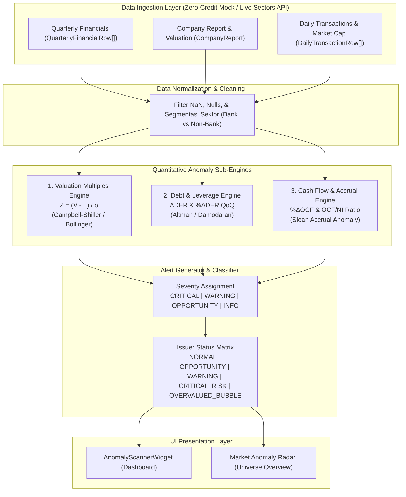

# Quantitative Anomaly Detection Engine

Dokumentasi resmi logika kuantitatif, rumus matematis, ambang batas (*thresholds*), dan landasan teori ilmiah untuk modul pemindai anomali pasar dan emiten (`lib/services/anomalyDetector.ts`) pada platform **Sector Sense**.

---

## 1. Ringkasan Eksekutif

Modul **Quantitative Anomaly Detection Engine** dirancang untuk mendeteksi anomali kondisi pasar dan fundamental emiten secara otomatis, objektif, dan terukur. Sistem membandingkan posisi valuasi terkini terhadap distribusi historis emiten, mendeteksi lonjakan rasio leverage/utang (DER), serta mengevaluasi kualitas laba akuntansi terhadap aliran kas riil (*forensic accrual analysis*).

### Fitur Utama:
1. **Valuation Anomaly Scanner**: Deteksi deviasi valuasi historis (PBV & PE) berbasis standar Gaussian Z-Score ($|Z| > 2.0\sigma$).
2. **Debt Spike & Leverage Shock**: Deteksi lonjakan rasio utang mendadak ($\ge +50\%$ QoQ atau delta $\ge +1.0\text{x}$) dan erosi ekuitas drastis ($> 25\%$).
3. **Forensic Cash Flow Quality**: Deteksi lonjakan arus kas mendadak ($\ge +150\%$) serta tanda bahaya divergensi akrual (*Sloan Accrual Red Flag*: Laba bersih positif tetapi arus kas operasi negatif).
4. **Composite Issuer Status**: Klasifikasi status emiten (`NORMAL`, `OPPORTUNITY`, `WARNING`, `CRITICAL_RISK`, `OVERVALUED_BUBBLE`) disertai daftar alert terstruktur dan saran aksi nyata (*action hints*).
5. **Zero-Quota Mock Compliance**: Terintegrasi penuh dengan arsitektur mock lokal (`lib/data/mock-anomalies.json` dan `lib/data/api-mock-db.json`) tanpa mengonsumsi kuota kredit Sectors API live.

---

## 2. Arsitektur & Alur Kerja Kuantitatif



---

## 3. Rumus Kuantitatif, Notasi Matematis, dan Sumber Referensi

### A. Pilar 1: Dislokasi Valuasi Historis (Valuation Multiples Z-Score)

#### 1. Konsep & Hipotesis:
Valuasi pasar emiten (Price-to-Earnings / PE dan Price-to-Book-Value / PBV) memiliki kecenderungan *mean-reverting* (kembali menuju rata-rata jangka panjangnya). Berdasarkan hukum distribusi normal Gaussian, sekitar 95.4% observasi berada di dalam rentang $\pm 2$ standar deviasi ($\pm 2\sigma$). Penyimpangan yang melampaui 2 standar deviasi ($|Z| > 2.0$) adalah peristiwa langka yang secara statistik merepresentasikan anomali pasar (anomali harga diskon ekstrem atau anomali gelembung spekulatif).

#### 2. Formula Matematis:
* **Rata-rata Sampel Historis ($\mu$)**:
  $$\mu = \frac{1}{N} \sum_{i=1}^{N} V_i$$
* **Standar Deviasi Sampel ($\sigma$, dengan Koreksi Bessel $N-1$)**:
  $$\sigma = \sqrt{\frac{1}{N-1} \sum_{i=1}^{N} (V_i - \mu)^2}$$
* **Standardized Score (Z-Score)**:
  $$Z = \frac{V_{\text{current}} - \mu}{\sigma}$$
  *Catatan*: Jika $\sigma < 1\text{e-}4$ (deret historis konstan) atau data sampel $N < 2$, sistem menerapkan deviasi persentase terhadap mean: $\Delta\% = \frac{V_{\text{current}} - \mu}{|\mu|}$.

#### 3. Ambang Batas (Thresholds):
* $Z < -2.0\sigma$: **`VALUATION_CRASH`** (Severity: `OPPORTUNITY`). Valuasi berada di diskon ekstrem bawah. Jika rasio utang aman dan arus kas sehat, kondisi ini menandakan kandidat *Deep Value Gem*.
* $-2.0\sigma \le Z < -1.5\sigma$: **Moderate Discount** (belum memicu alert anomali).
* $-1.5\sigma \le Z \le +1.5\sigma$: **Normal Baseline Range**.
* $+1.5\sigma < Z \le +2.0\sigma$: **Moderate Premium**.
* $Z > +2.0\sigma$: **`VALUATION_SURGE`** (Severity: `WARNING`). Valuasi diperdagangkan dengan premi berlebihan yang rentan terhadap aksi koreksi pembalikan (*mean-reversion sell-off*).

#### 4. Sumber & Referensi Akademis:
1. **Campbell, J. Y., & Shiller, R. J. (1998)**: *"Valuation Ratios and the Long-Run Stock Market Outlook"*, The Journal of Portfolio Management, 24(2), 11-26.  
   *(Membuktikan bahwa deviasi rasio valuasi PE dan PBV terhadap rata-rata historis adalah prediktor pembalikan harga jangka panjang).*
2. **Bollinger, John (2001)**: *"Bollinger on Bollinger Bands"*, McGraw-Hill Education.  
   *(Standar industri penggunaan pita $\pm 2\sigma$ dari distribusi Gaussian untuk menetapkan batas anomali volatilitas harga).*
3. **Avellaneda, M., & Lee, J. H. (2010)**: *"Statistical Arbitrage in the US Equities Market"*, Quantitative Finance, 10(7), 761-782.  
   *(Penerapan Z-Score residual valuasi kuantitatif untuk memicu sinyal dislokasi pasar).*

---

### B. Pilar 2: Lonjakan Rasio Utang (Debt Spike & Leverage Shock)

#### 1. Konsep & Hipotesis:
Struktur permodalan yang stabil adalah fondasi kelangsungan usaha (*going concern*). Lonjakan rasio utang terhadap ekuitas (*Debt-to-Equity Ratio* / DER) yang terjadi secara tiba-tiba dalam kurun waktu 1 kuartal mengindikasikan:
- Peningkatan beban liabilitas jangka pendek secara agresif.
- Pengikisan nilai buku ekuitas (*equity erosion*) akibat kerugian operasional masif atau penarikan dividen berlebihan.

#### 2. Formula Matematis:
* **Rasio Utang terhadap Ekuitas (DER)**:
  $$DER_t = \frac{\text{Total Liabilities}_t}{\text{Total Equity}_t}$$
* **Perubahan Absolut Kuartalan (Delta QoQ)**:
  $$\Delta DER_{\text{QoQ}} = DER_t - DER_{t-1}$$
* **Persentase Perubahan Relatif (QoQ Growth)**:
  $$\% \Delta DER_{\text{QoQ}} = \frac{DER_t - DER_{t-1}}{DER_{t-1}} \times 100\%$$
* **Persentase Perubahan Ekuitas (Equity Growth)**:
  $$\% \Delta \text{Equity}_{\text{QoQ}} = \frac{\text{Equity}_t - \text{Equity}_{t-1}}{\text{Equity}_{t-1}} \times 100\%$$

#### 3. Ambang Batas (Thresholds):
* **Sektor Non-Finansial**:
  - Alert `DEBT_SPIKE` aktif jika:
    $$\% \Delta DER_{\text{QoQ}} \ge +50\% \quad \text{DAN} \quad DER_t \ge 1.5\text{x}$$
    ATAU lonjakan absolut $\Delta DER_{\text{QoQ}} \ge +1.0\text{x}$.
  - Tingkat Keparahan: `CRITICAL` jika $DER_t > 3.0\text{x}$, atau `WARNING` jika $1.5\text{x} \le DER_t \le 3.0\text{x}$.
* **Sektor Perbankan (Bank-Adjusted)**:
  - Bank secara inheren mengelola Dana Pihak Ketiga (DPK) yang dicatat sebagai liabilitas.
  - Alert aktif jika $DER_t > 8.0\text{x}$ atau liabilitas naik $> 30\%$ sementara ekuitas stagnan/menurun.
* **Erosi Ekuitas (`EQUITY_EROSION`)**:
  - Alert `CRITICAL` aktif jika ekuitas tergerus $> 25\%$ dalam satu kuartal ($\% \Delta \text{Equity} \le -25\%$) atau ekuitas bernilai negatif ($\text{Equity}_t \le 0$).

#### 4. Sumber & Referensi Akademis:
1. **Altman, Edward I. (1968)**: *"Financial Ratios, Discriminant Analysis and the Prediction of Corporate Bankruptcy"*, The Journal of Finance, 23(4), 589-609.  
   *(Menetapkan rasio liabilitas terhadap nilai ekuitas sebagai variabel kunci model prediksi kebangkrutan Altman Z-Score).*
2. **Damodaran, Aswath (NYU Stern)**: *"Applied Corporate Finance"*, 4th Edition, John Wiley & Sons.  
   *(Membahas ambang batas debt capacity, risiko default, dan biaya keagenan utang).*
3. **Basel Committee on Banking Supervision (Basel III Framework) & OJK**:  
   *(Standar regulasi permodalan minimum dan rasio pengungkit / leverage perbankan).*

---

### C. Pilar 3: Arus Kas & Analisis Forensik Akrual (Cash Flow Shock & Accrual Anomaly)

#### 1. Konsep & Hipotesis:
Laba akuntansi (*Accounting Net Income*) disusun berdasarkan basis akrual dan rentan terhadap estimasi manajemen atau pengakuan pendapatan agresif. Arus kas operasi (*Operating Cash Flow* / OCF) menyajikan aliran kas riil hasil operasional perusahaan. Divergensi antara laba akuntansi dan kas masuk adalah salah satu sinyal bahaya kualitas pelaporan keuangan (*forensic red flag*) paling akurat di pasar modal.

#### 2. Formula Matematis:
* **Pertumbuhan Arus Kas Operasi Kuartalan (QoQ)**:
  $$\% \Delta OCF_{\text{QoQ}} = \frac{OCF_t - OCF_{t-1}}{|OCF_{t-1}|} \times 100\%$$
* **Rasio Konversi Kas terhadap Laba (Cash-to-Earnings Ratio)**:
  $$\text{Quality Ratio} = \frac{OCF_t}{\text{Net Income}_t}$$

#### 3. Ambang Batas (Thresholds):
* **`EARNINGS_CASH_DIVERGENCE` (CRITICAL RED FLAG)**:
  $$\text{Net Income}_t > 0 \quad \text{namun} \quad OCF_t < 0$$
  - Terjadi ketika perusahaan melaporkan laba bersih positif, namun kas operasionalnya justru mengalami defisit (arus kas keluar). Laba hanya ada di atas kertas (didominasi piutang yang belum tertagih atau kapitalisasi beban).
* **Low Cash Conversion Alert (WARNING)**:
  $$\text{Net Income}_t > 0, \quad OCF_t > 0, \quad \text{dan} \quad \text{Quality Ratio} < 0.20$$
  - Arus kas operasi yang terealisasi kurang dari 20% dari nilai laba bersih yang dilaporkan.
* **`CASH_FLOW_SURGE` (INFO / Positive Anomaly)**:
  $$\% \Delta OCF_{\text{QoQ}} \ge +150\%$$
  - Lonjakan kas operasional mendadak. Sistem menyarankan pengguna memeriksa apakah lonjakan bersifat rutin operasional atau *one-off working capital collection*.
* **`CASH_FLOW_DROP` (WARNING)**:
  $$\% \Delta OCF_{\text{QoQ}} \le -80\% \quad \text{atau OCF anjlok drastis dari kuartal sebelumnya}$$

#### 4. Sumber & Referensi Akademis:
1. **Sloan, Richard G. (1996)**: *"Do Stock Prices Fully Reflect Information in Accruals and Cash Flows about Future Earnings?"*, The Accounting Review, 71(3), 289-315.  
   *(Penelitian klasik yang membuktikan fenomena Sloan Accrual Anomaly: emiten dengan komponen akrual tinggi dan kas rendah secara konsisten mengalami pembalikan laba negatif di masa depan).*
2. **Beneish, Messod D. (1999)**: *"A Profile of Financial Statement Fraud"*, Financial Analysts Journal, 55(5), 24-36.  
   *(Pengembang Beneish M-Score, menggunakan rasio Total Accruals to Total Assets / TATA sebagai detektor manipulasi laba).*
3. **CFA Institute Curriculum (Level II)**: *"Financial Reporting and Analysis — Evaluating Quality of Financial Reports"*, CFA Institute.  
   *(Standar global analis keuangan yang menetapkan rasio $CFO < NI$ sebagai indikator utama penurunan kualitas laba).*

---

## 4. Matriks Klasifikasi Status Emiten (Composite Anomaly Status)

Berdasarkan gabungan dari seluruh alert yang terpicu, sistem menetapkan status komposit emiten secara deterministik:

| Status Emiten | Kondisi Logika Kuantitatif | Skor Anomali | Implikasi Keputusan Investor |
| :--- | :--- | :---: | :--- |
| **`CRITICAL_RISK`** | Terdeteksi $\ge 1$ alert `CRITICAL` (misal: Divergensi Laba vs Kas, Erosi Ekuitas $>25\%$, atau DER Spike $>3\text{x}$). | 90 | **Hindari / Jual**. Kualitas fundamental berada di zona bahaya; risiko kerugian modal tinggi. |
| **`OPPORTUNITY`** | Valuasi $Z < -2.0\sigma$ (`VALUATION_CRASH`), tidak ada lonjakan utang, dan $OCF \ge 0$. | 75 | **Peluang Akumulasi**. Saham sehat terdiskon ekstrem akibat kepanikan pasar temporer (*Undervalued Gem*). |
| **`OVERVALUED_BUBBLE`** | Valuasi $Z > +2.0\sigma$ (`VALUATION_SURGE`) tanpa lonjakan arus kas yang proporsional. | 80 | **Waspada / Ambil Untung**. Saham diperdagangkan dengan valuasi terlalu mahal; rawan pembalikan mean-reversion. |
| **`WARNING`** | Terdeteksi $\ge 1$ alert `WARNING` (misal: lonjakan DER moderat atau penurunan OCF). | 55 | **Pantau Berkala**. Terjadi peningkatan volatilitas finansial yang memerlukan kewaspadaan. |
| **`NORMAL`** | $|Z| \le 1.5\sigma$, DER stabil, dan $OCF$ sejalan dengan laba bersih. | 15 | **Stabil**. Fundamental berada dalam rentang wajar historis tanpa keanehan sistemik. |

---

## 5. Keselarasan Skema Data Mock dengan API Asli `lib/sectors`

Sesuai aturan Track 3 Hackathon, seluruh pemrosesan anomali didukung oleh data mock lokal yang **100% patuh pada antarmuka TypeScript resmi di [`lib/sectors/types.ts`](file:///D:/pribadi/Projects/sector-sense/lib/sectors/types.ts)**:

```ts
// 1. Respon /v2/company/report/{symbol}/
export interface CompanyReport {
  symbol: string;
  company_name: string;
  overview?: CompanyOverview;
  valuation?: CompanyValuation;
}

// 2. Respon /v2/financials/quarterly/{symbol}/
export interface QuarterlyFinancialRow {
  report_date: string;
  quarter: string;
  year?: number;
  revenue?: number;
  net_income?: number;
  total_assets?: number;
  total_liabilities?: number;
  total_equity?: number;
  operating_cash_flow?: number;
  pe?: number;
  pb?: number;
}
```

Data mock disimpan pada:
- [`lib/data/mock-anomalies.json`](file:///D:/pribadi/Projects/sector-sense/lib/data/mock-anomalies.json): Dataset lengkap 6 emiten IDX untuk pengujian unit dan scanning instan.
- [`lib/data/api-mock-db.json`](file:///D:/pribadi/Projects/sector-sense/lib/data/api-mock-db.json): Terhubung ke `mockInterceptor.ts` yang mencegat panggilan endpoint saat `MOCK_API=true` di `.env.local`.

---

## 6. Contoh Penggunaan Programatis

```typescript
import { scanIssuerAnomalies, scanUniverseAnomalies } from '@/lib/services/anomalyDetector';

// 1. Memindai Anomali Emiten Tertentu
const report = await scanIssuerAnomalies('BBRI');
console.log(`Status: ${report.status}`); // "OPPORTUNITY"
console.log(`Skor Anomali: ${report.anomalyScore}`); // 75
console.log(`PBV Z-Score: ${report.metricsBreakdown.valuation.pb.zScore}`); // -2.25σ
console.log(`Jumlah Alert: ${report.alerts.length}`);

// 2. Memindai Keseluruhan Pasar Pantauan
const universe = await scanUniverseAnomalies(['BBCA', 'BBRI', 'GOTO', 'ARTO', 'BUMI']);
console.log(`Kondisi Pasar: ${universe.marketOverview.status}`); // "OPPORTUNITY_RICH"
console.log(`Alert Prioritas Tinggi: ${universe.highPriorityAlerts.length}`);
```

---

## 7. Verifikasi & Pengujian Otomatis

Seluruh formula dan logika diuji melalui suite pengujian otomatis Node.js runner:

```bash
npm test
```

Suite pengujian mencakup 16 test case khusus di `tests/anomaly-scanner.test.mjs`:
- Perhitungan mean dan varians sampel dengan koreksi Bessel ($N-1$).
- Perhitungan Z-score dan penanganan batas (flat series / pembagian nol).
- Pengujian pemicu dislokasi valuasi ($Z < -2.0$ dan $Z > +2.0$).
- Pengujian lonjakan rasio utang dan erosi ekuitas kuartalan.
- Pengujian divergensi laba vs kas operasi (*Sloan Accrual Red Flag*).
- Pengujian isolasi luring tanpa ketergantungan jaringan eksternal.
