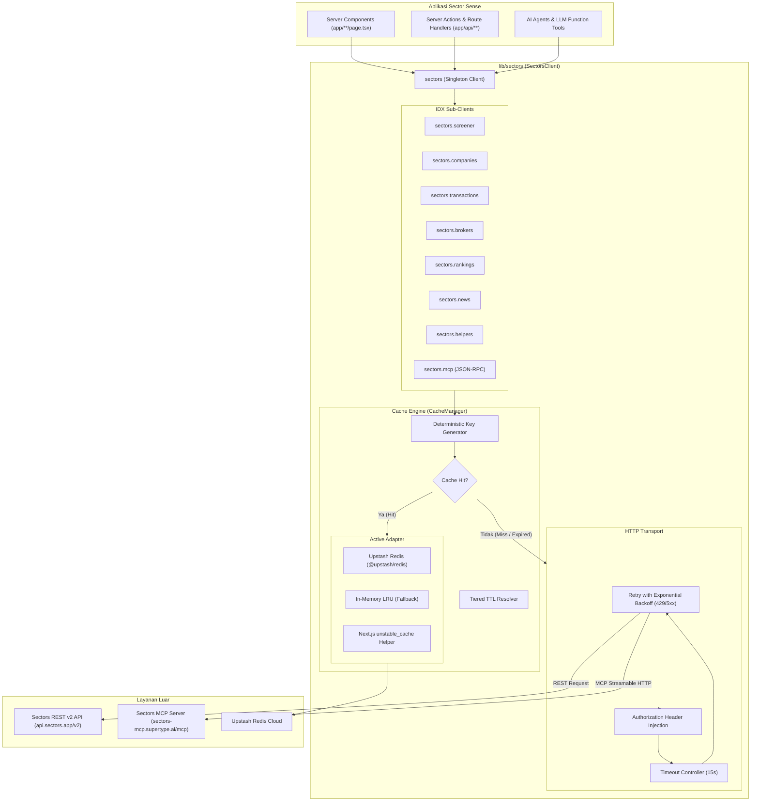

# Sectors Financial API Client & Caching Layer

Dokumentasi resmi untuk modul HTTP Client terisolasi Sectors Financial API (`lib/sectors`) pada project **Sector Sense**.

Modul ini dirancang untuk mengonsumsi data pasar modal Indonesia (IDX) dari platform [Sectors Financial API](https://sectors.app) (REST v2 & MCP Streamable HTTP) dengan perlindungan rate-limit otomatis dan multi-layer caching berbasis **Upstash Redis**, **Next.js Data Cache**, dan **In-Memory Cache**.

---

## 1. Arsitektur & Alur Kerja



---

## 2. Konfigurasi Environment Variables

Salin variabel berikut ke file `.env.local`:

```ini
# ==========================================
# Sectors Financial API
# ==========================================
# Dapatkan API key dari https://sectors.app/api (paket Insider)
SECTORS_API_KEY=sk_live_your_actual_api_key_here
SECTORS_API_BASE_URL=https://api.sectors.app/v2
SECTORS_MCP_URL=https://sectors-mcp.supertype.ai/mcp

# ==========================================
# Upstash Redis Cache (Opsional)
# ==========================================
# Caching terdistribusi untuk Serverless / Edge runtime
UPSTASH_REDIS_REST_URL=https://your-database.upstash.io
UPSTASH_REDIS_REST_TOKEN=your_upstash_rest_token_here
```

### Mekanisme Graceful Fallback
Modul mendeteksi konfigurasi cache secara otomatis (`adapter: 'auto'`):
- Jika `UPSTASH_REDIS_REST_URL` dan `UPSTASH_REDIS_REST_TOKEN` tersedia, client akan menggunakan **Upstash Redis**.
- Jika tidak disetel (misalnya saat proses pengujian lokal), client otomatis beralih ke **In-Memory Cache** atau **Next.js Data Cache** tanpa menimbulkan error.

---

## 3. Strategi Caching & Tiered TTL Policies

Data finansial memiliki tingkat volatilitas yang bervariasi. Modul membagi TTL ke dalam 4 tingkatan (*tiers*) untuk menekan pemborosan kredit API Sectors:

| Tier | TTL Bawaan | Kategori Data | Contoh Endpoint |
|---|---|---|---|
| **`static`** | **24 Jam** (86.400s) | Taksonomi sektor, industri, tags, daftar emiten bersegmen, registrasi broker, MCP tools list | `/v2/subsectors/`, `/v2/brokers/`, `/v2/tags/` |
| **`fundamental`** | **6 Jam** (21.600s) | Laporan tahunan emiten, keuangan kuartalan, komposisi pemegang saham, analisis free float, corporate actions | `/v2/company/report/{symbol}/`, `/v2/financials/quarterly/{symbol}/` |
| **`market`** | **10 Menit** (600s) | Harga transaksi harian, universe close, top gainers/losers, broker summary harian, foreign flow | `/v2/daily/{symbol}/`, `/v2/close/`, `/v2/companies/top-changes/`, `/v2/foreign-flow/{symbol}/` |
| **`realtime`** | **3 Menit** (180s) | Berita emiten terkini, keterbukaan informasi transaksi orang dalam (*insider filings*), suspensi saham | `/v2/news/`, `/v2/filings/`, `/v2/suspensions/` |

### Opsi Kustom Caching Per Request
Setiap method endpoint menerima opsi kontrol cache:

```typescript
import { sectors } from '@/lib/sectors';

// 1. Kustom TTL (misal cache hanya selama 60 detik)
const data = await sectors.transactions.getDaily('BBCA', { start: '2026-01-01' }, {
  ttl: 60,
});

// 2. Bypass Cache (memaksa mengambil data langsung dari API)
const liveData = await sectors.companies.getReport('BBCA', undefined, {
  skipCache: true,
});

// 3. Force Refresh (mengambil data fresh lalu memperbarui cache)
const refreshed = await sectors.rankings.getTopChanges(undefined, {
  forceRefresh: true,
});
```

### Invalidasi Cache Berbasis Tag
Setiap entri cache disimpan dengan metadata tag (misal `company:BBCA`, `market:close`). Anda dapat menginvalidasi cache spesifik kapan saja:

```typescript
// Menghapus seluruh cache terkait BBCA (report, daily price, financials)
await sectors.invalidateTag('company:BBCA');

// Menghapus cache harga penutupan pasar
await sectors.invalidateTag('market:close');

// Menghapus seluruh namespace cache sectors
await sectors.clearCache();
```

---

## 4. Panduan Sub-Client & Contoh Penggunaan (IDX)

Impor singleton instance `sectors` dari `@/lib/sectors`:

```typescript
import { sectors } from '@/lib/sectors';
```

### A. Screener & Filter Saham (`sectors.screener`)
```typescript
// 1. Structured query (SQL-like): 1 kredit
const screenResult = await sectors.screener.companies({
  where: "sub_sector = 'banks' and pb < 2.5",
  order_by: "-market_cap",
  limit: 10,
});

// 2. Natural language query (AI-powered): 3 kredit
const aiScreen = await sectors.screener.companies({
  q: "top dividend companies in consumer goods with positive net profit",
});

// 3. Free Float Market Analysis
const freeFloats = await sectors.screener.freeFloat({
  sub_sector: 'banks',
});
```

### B. Profil & Fundamental Emiten (`sectors.companies`)
```typescript
// 1. Laporan lengkap emiten (overview, valuation, financials, dividend, dll)
const report = await sectors.companies.getReport('BBCA', {
  sections: ['overview', 'valuation', 'dividend'],
});

// 2. Laporan keuangan kuartalan (termasuk metrik perbankan: net_interest_income, gross_loan)
const financials = await sectors.companies.getQuarterlyFinancials('BMRI', {
  n_quarters: 4,
});

// 3. Komposisi pemegang saham (domestik vs asing)
const shareholders = await sectors.companies.getShareholders('TLKM', 2025);

// 4. Corporate Actions (dividen, stock split, RUPS)
const actions = await sectors.companies.getCorporateActions('ASII');

// 5. Performa sejak IPO (7d, 30d, 90d, 365d, since_ipo)
const ipoPerformance = await sectors.companies.getListingPerformance('BREN');
```

### C. Transaksi & Data Pasar (`sectors.transactions`)
```typescript
// 1. Harga penutupan harian, volume, market cap (hingga rentang 90 hari)
const daily = await sectors.transactions.getDaily('BBCA', {
  start: '2026-01-01',
  end: '2026-03-01',
});

// 2. Harga penutupan seluruh saham IDX pada satu hari bursa (feed massal)
const universeClose = await sectors.transactions.getUniverseClose('2026-03-15');

// 3. Riwayat total kapitalisasi pasar IHSG
const idxMarketCap = await sectors.transactions.getIdxMarketCap({
  start: '2026-01-01',
});

// 4. Riwayat indeks harian (LQ45, IDX30, KOMPAS100)
const lq45Daily = await sectors.transactions.getIndexDaily('LQ45', {
  start: '2026-02-01',
});
```

### D. Data Broker & Foreign Flow (`sectors.brokers`)
```typescript
// 1. Registrasi kode broker IDX resmi (asal negara, cohort retail/institutional)
const brokerRegistry = await sectors.brokers.getRegistry({
  origin: 'foreign',
});

// 2. Peringkat broker harian berdasarkan gross trade value atau net flow
const topBrokers = await sectors.brokers.getTopBrokers({
  date: '2026-03-15',
  metric: 'net',
  n_brokers: 10,
});

// 3. Broker Summary per saham (siapa yang beli/jual saham tertentu)
const brokerSummary = await sectors.brokers.getSummaryBySymbol('BBRI', {
  start: '2026-03-01',
  end: '2026-03-14',
});

// 4. Top Akumulasi & Distribusi Broker untuk suatu saham
const topBrokersForStock = await sectors.brokers.getTopBrokersBySymbol('BBCA', {
  n_brokers: 5,
});

// 5. Net Foreign Flow (Arus Modal Asing Harian)
// Nilai positif = akumulasi asing (net buy), nilai negatif = distribusi asing (net sell)
const foreignFlow = await sectors.brokers.getForeignFlow('BMRI', {
  start: '2026-01-01',
  end: '2026-03-15',
});
```

### E. Peringkat Pasar (`sectors.rankings`)
```typescript
// Top Gainers dan Top Losers (periode 1d, 7d, 30d, 365d)
const movers = await sectors.rankings.getTopChanges({
  classifications: ['top_gainers', 'top_losers'],
  periods: ['1d', '7d'],
  sub_sector: 'banks',
  n_stock: 5,
});

// Saham paling aktif diperdagangkan berdasarkan volume transaksi
const mostTraded = await sectors.rankings.getMostTraded({
  start: '2026-03-01',
  end: '2026-03-15',
  n_stock: 10,
});
```

### F. Berita, Filings & Suspensi (`sectors.news`)
```typescript
// 1. Berita pasar modal IDX
const articles = await sectors.news.getArticles({
  symbols: ['BBCA', 'BMRI'],
  keyword: 'dividen',
});

// 2. Keterbukaan informasi transaksi direksi/pemegang saham pengendali (insider trading)
const filings = await sectors.news.getFilings({
  symbol: 'BBCA',
  transaction_type: 'buy',
});

// 3. Riwayat suspensi perdagangan saham beserta alasan resmi BEI
const suspensions = await sectors.news.getSuspensions({
  start: '2026-01-01',
});
```

### G. Helper Taksonomi & Metadata (`sectors.helpers`)
```typescript
// 1. Daftar seluruh pasangan subsector/sector
const subsectors = await sectors.helpers.getSubsectors();

// 2. Daftar industri
const industries = await sectors.helpers.getIndustries();

// 3. Daftar seluruh emiten yang memiliki data segmen pendapatan
const segmentCompanies = await sectors.helpers.getCompaniesWithSegments();

// 4. Laporan agregat subsector
const bankingSectorReport = await sectors.helpers.getSubsectorReport('banks');
```

---

## 5. Integrasi Model Context Protocol (MCP) untuk AI Agent

Sectors menyediakan MCP Server di `https://sectors-mcp.supertype.ai/mcp` dengan 65+ alat bantu finansial. Sub-client `sectors.mcp` memungkinkan agent AI memanggil tools secara dinamis melalui protokol JSON-RPC 2.0:

```typescript
import { sectors } from '@/lib/sectors';

// 1. Menemukan semua tools finansial yang tersedia (otomatis dicache 24 jam)
const tools = await sectors.mcp.listTools();
console.log(`Ditemukan ${tools.length} alat bantu MCP di Sectors.`);

// 2. Menjalankan tool MCP
const toolResult = await sectors.mcp.callTool('fetch-company-report', {
  ticker: 'BBCA',
  sections: 'overview,valuation',
});

// 3. Helper pemanggilan langsung dengan hasil JSON ter-parse
interface CompanyOverviewResponse {
  symbol: string;
  overview: { sector: string; market_cap: number };
}

const data = await sectors.mcp.callToolAndParseJson<CompanyOverviewResponse>(
  'fetch-company-report',
  { ticker: 'BBRI', sections: 'overview' }
);
console.log(data.overview.sector); // 'Financials'
```

---

## 6. Error Handling & Rate Limit Backoff

Client memiliki penanganan error terstruktur:

| Kelas Error | Status HTTP | Keterangan & Tindakan |
|---|---|---|
| `SectorsAuthError` | `401` / `403` | API key tidak ada atau salah. Periksa `SECTORS_API_KEY`. |
| `SectorsNotFoundError` | `404` | Simbol saham atau kode indeks tidak ditemukan di BEI/IDX. |
| `SectorsRateLimitError` | `429` | Batas rate limit terlampaui. Memuat properti `retryAfterSeconds`. |
| `SectorsValidationError` | `400` | Format parameter query tidak valid (misal tanggal tidak sesuai `YYYY-MM-DD`). |
| `SectorsServerError` | `5xx` | Gangguan server upstream Sectors. |

### Mekanisme Otomatis Exponential Backoff
Ketika upstream mengembalikan kode `429 Too Many Requests` atau `503 Service Unavailable`:
1. Client memeriksa header `Retry-After` dari server.
2. Jika tidak ada, client melakukan kalkulasi delay:
   $$\text{Delay} = \text{InitialDelay} \times 2^{\text{attempt}} + \text{jitter}$$
3. Client mencoba ulang hingga 3 kali secara otomatis sebelum melempar exception `SectorsRateLimitError`.

Contoh implementasi penanganan error di aplikasi:
```typescript
import {
  sectors,
  SectorsAuthError,
  SectorsNotFoundError,
  SectorsRateLimitError,
} from '@/lib/sectors';

try {
  const data = await sectors.companies.getReport('BBCA');
} catch (error) {
  if (error instanceof SectorsAuthError) {
    console.error('Kredensial API Sectors bermasalah.');
  } else if (error instanceof SectorsNotFoundError) {
    console.error('Ticker tidak ditemukan di IDX.');
  } else if (error instanceof SectorsRateLimitError) {
    console.warn(`Rate limit tercapai, silakan coba dalam ${error.retryAfterSeconds} detik.`);
  } else {
    console.error('Terjadi kesalahan:', (error as Error).message);
  }
}
```

---

## 7. Pengujian & Verifikasi

Jalankan test suite menggunakan:
```bash
npm test
```
Test suite di `tests/sectors-client.test.mjs` memvalidasi fungsionalitas caching, timeout, retry backoff, serialisasi parameter query, dan parsing JSON-RPC MCP.
